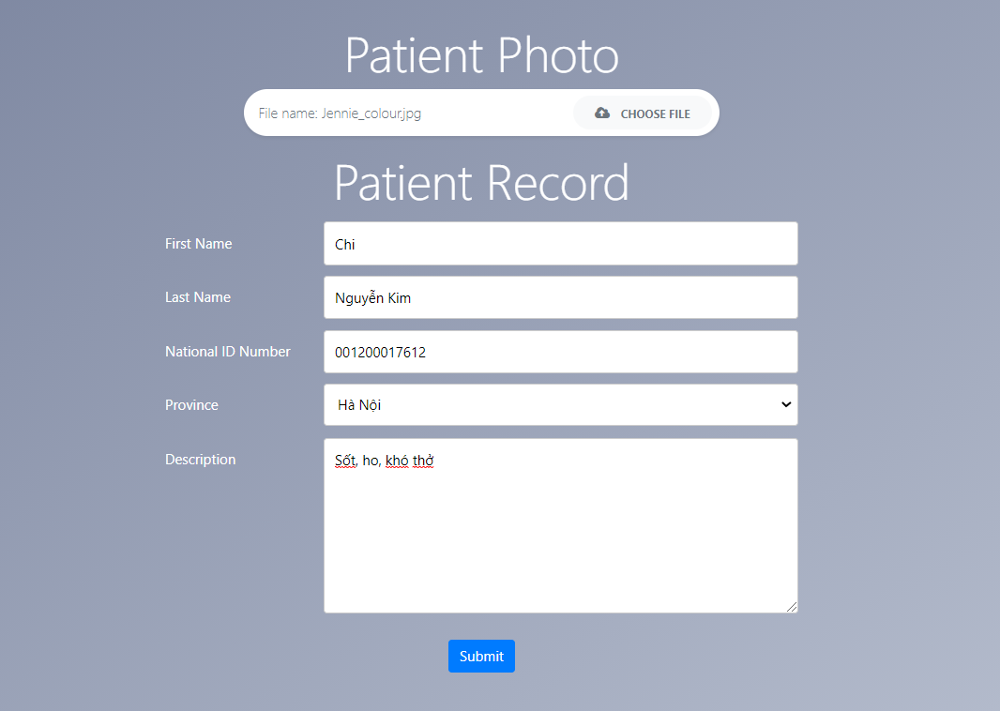
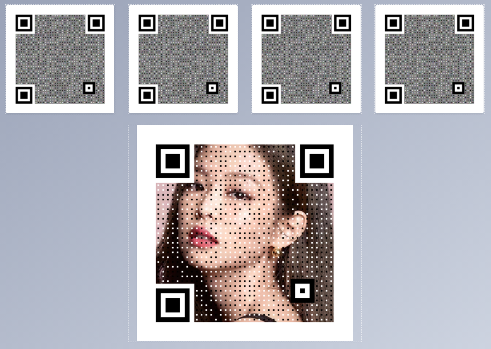

# AnToanThongTin_BaiGK

##### Tổng quan
Hệ thống xây dựng các bản mã QR chứa thông tin bệnh nhân để in trên các bao bì thuốc. Nếu tất cả các bản mã QR là đầy đủ và hợp lệ thì chúng có thể kết hợp để xuất ra bức ảnh được chụp từ bệnh nhân.

##### Cách sử dụng
Chi tiết các thuật toán và cách cài đặt có thể xem tại file Báo cáo.pdf

Hệ thống có thể được chạy trên web tại địa chỉ locallhost/qrshares/index.php bằng cách thực hiện các bước theo trình tự:
- Khởi động XAMPP.
- Truy cập địa chỉ locallhost/qrshares/index.php trên trình duyệt.

##### Giao diện màn hình
  

  

